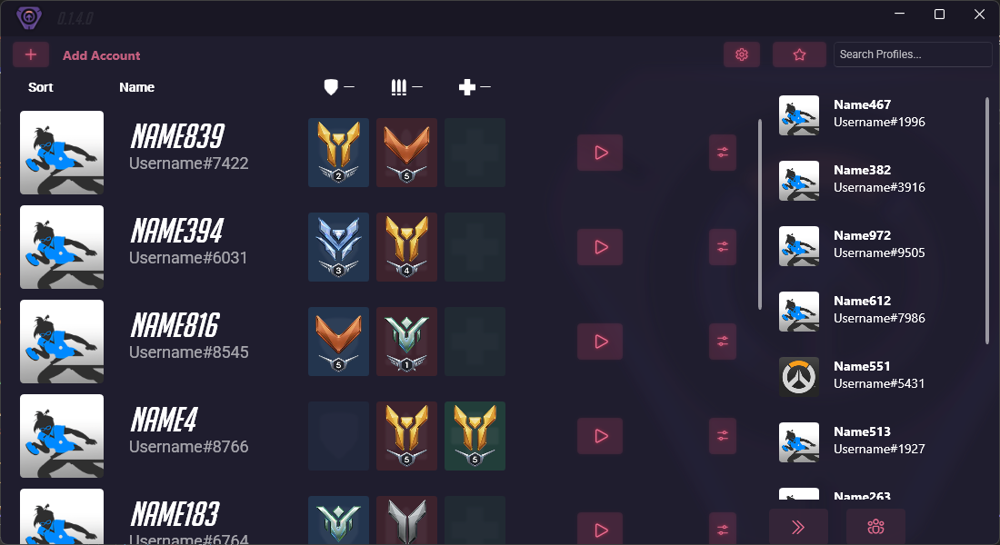
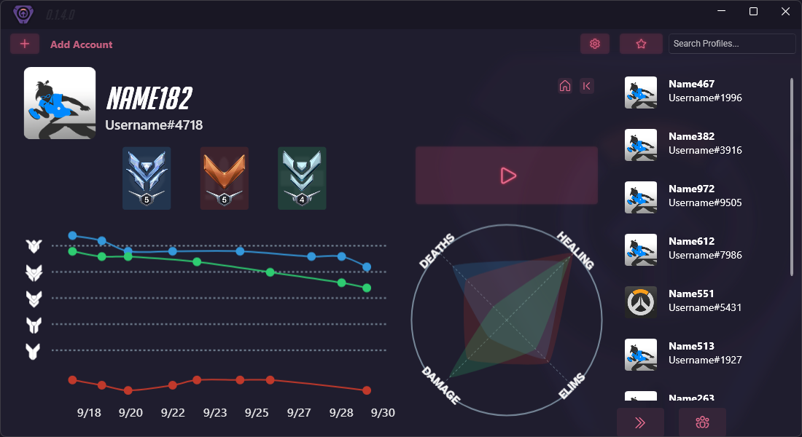
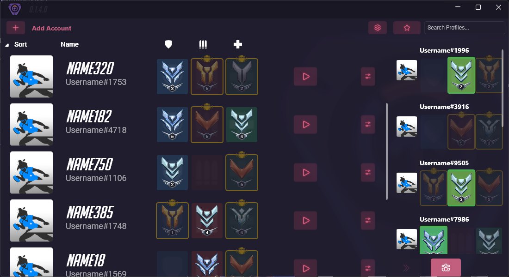

<h1 align="center">Pulse</h1>

A tool to switch between Overwatch accounts and view account ranks at a glance.

---
> ⚠️ **Note**: Pulse requires a windows **Battle.net installation** of Overwatch to function properly. **Steam versions are not supported** for account switching.

# Features

- **Account Switching**  
  Add your own Overwatch accounts and quickly switch between them via Battle.net.

- **Automatic Overwatch Launching**  
  Launch Overwatch directly from Pulse with a specified account  

- **Profile Tracking**  
  Track ranks of Personal or Friend accounts over time, as well as key statistics

- **Auto Account Detection**  
  Scans Battle.net memory to detect the logged-in accounts or profiles of added friends.

- **Group Selection Mode**  
  Choose roles for your party members and see which of your accounts can be played without forming a wide group.

# Installation
### Installer
- Download the latest installer from the [Releases Page]("https://github.com/imshyft/Pulse-Account-Manager/releases")
- Run the installer and follow the prompts
- Upon launching the program, verify the overwatch install directory (select the "Overwatch Launcher.exe file found in the install dir), and the battle net config file (should be done automatically)

# Usage
**Most buttons have tooltips which display upon hovering for more info*
- Click the 'Add Account' Button and follow the prompts to add a Personal or Friend account
- Pressing the play button on the main page will switch accounts in Battle.net and launch Overwatch
- Click on accounts in the main list or side panel to inspect rank and stats
- To fetch the latest data, press the reload button from the options menu on the main page or right click on an account in the side page

## Bugs + Feature Requests
If you encounter any bugs/crashes or have any ideas for improvements, feel free to make an issue :]